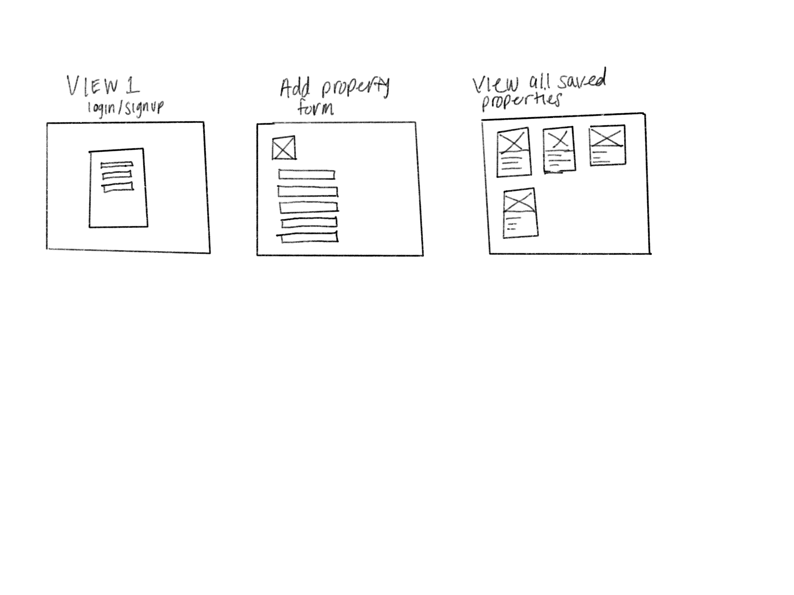
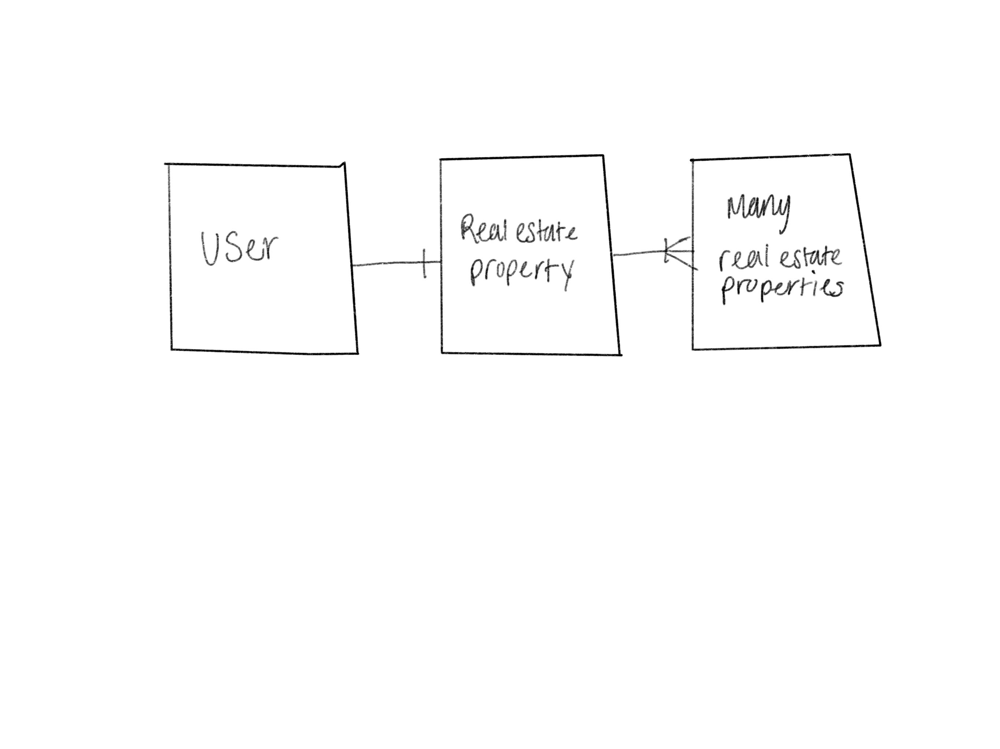
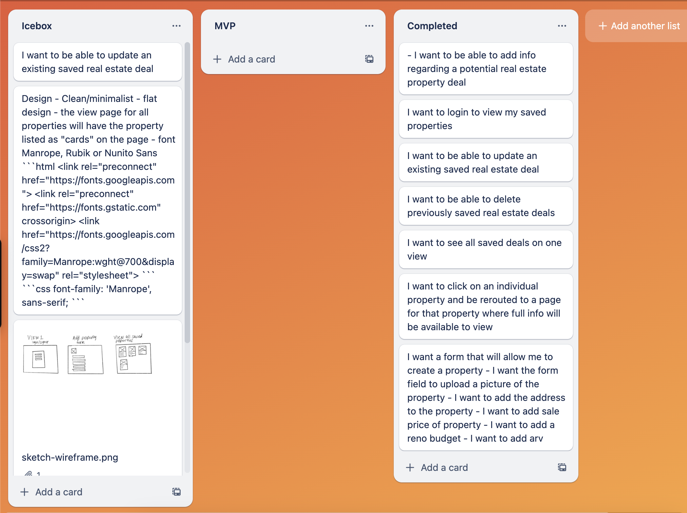

# Real Estate Tracker

## Screenshots

## Wireframe Sketch

## ERD

## Trello

## Technologies Used
- MongoDb
- MongoAtlas
- Express
- Node.js
- Fly.io

## Getting Started
- https://realestatetracker.fly.dev/
- https://github.com/xaviercarter/real-estate-tracker

## Next Steps

 - incorporate front end design
 - add bootstrap to create a more visually aesthetic UI
 - add cards for each property
 - get images functionality to work so each property can have an image
 - debug contractor functionality